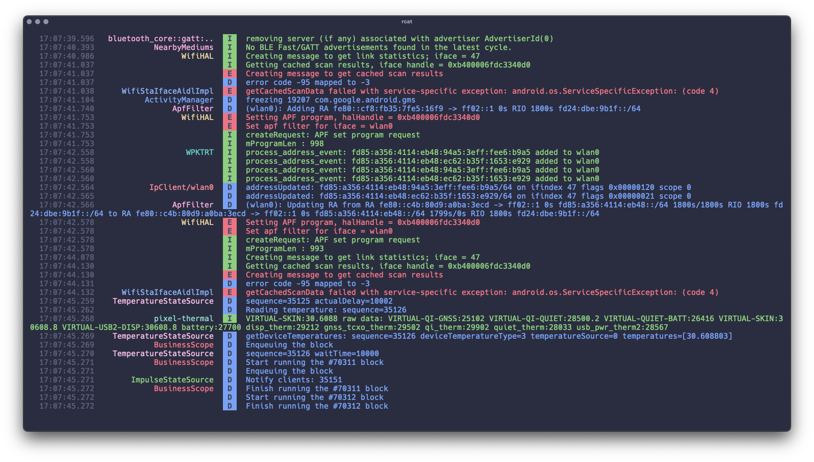

<div align="center">
  <h1>🦀 RustyCat</h1>
  

```bash
rcat "com.example.app.*"
```

</div>


## About

RustyCat is a modern Android logcat viewer written in Rust that makes debugging Android applications more pleasant with colored output and smart formatting.

## Features

- 🎨 Colored log levels (Debug, Info, Warning, Error, Verbose, Fatal)
- 🏷️ Smart tag coloring with 12 distinct colors
- ⏰ Precise timestamps with millisecond precision
- 📱 Package filtering support (e.g., com.example.app or com.example.*)
- 🔍 Advanced filtering options (by log level, content, and exclusions)
- 📝 Intelligent tag display (shows tags only when they change)
- 📊 Clean formatting with proper padding and alignment
- 🔄 Multi-line log support with proper indentation
- ⌨️ Interactive mode (press 'q' to quit)
- 🧹 Automatic logcat buffer clearing on start

## Installation

```bash
cargo install rustycat-android
```

## Usage
```bash
rcat
```

Filter by package name:

```bash
rcat com.example.app
```

Filter with wildcard:

```bash
rcat "com.example.*"
```

Hide timestamps:

```bash
rcat --no-timestamp
# or
rcat -t
```

Filter by log level:
```bash
# Show only Debug and Error logs
rcat -l "D,E"
```

Filter by tag:
```bash
# Show only logs from specific tag
rcat --tag SystemUI
# or
rcat -g ActivityManager
```

Filter by content:
```bash
# Show only logs containing "network"
rcat -f "network"

# Exclude logs containing "verbose"
rcat -e "verbose"

# Combine filters
rcat "com.example.app" -l "E,W" -f "network" -e "verbose"
```


## Acknowledgments
Built with ❤️ using Rust

Inspired by traditional logcat viewers like [pidcat](https://github.com/JakeWharton/pidcat)
