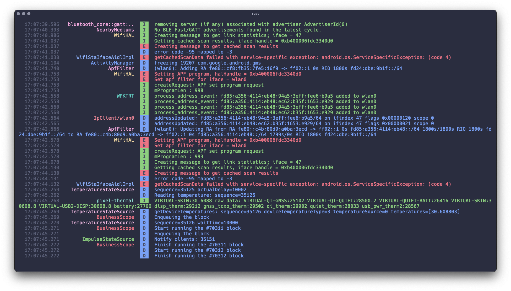

<div align="center">
  <h1>🦀 RustyCat</h1>

```bash
rcat com.example.app.*
```
  
  
</div>


## About

RustyCat is a modern Android logcat viewer written in Rust that makes debugging Android applications more pleasant with colored output and smart formatting.

## Features

- 🎨 Colored log levels (Debug, Info, Warning, Error, Verbose, Fatal)
- 🏷️ Smart tag coloring with 12 distinct colors
- ⏰ Precise timestamps with millisecond precision
- 📱 Package filtering support (e.g., com.example.app or com.example.*)
- 📝 Intelligent tag display (shows tags only when they change)
- 📊 Clean formatting with proper padding and alignment
- 🔄 Multi-line log support with proper indentation
- ⌨️ Interactive mode (press 'q' to quit)
- 🧹 Automatic logcat buffer clearing on start

## Installation

```bash
cargo install rustycat
```

## Usage
```bash
rcat
```

Filter by package name:

```bash
rcat com.example.app
```

Filter with wildcard:

```bash
rcat "com.example.*"
```


## Acknowledgments
Built with ❤️ using Rust

Inspired by traditional logcat viewers like [pidcat](https://github.com/JakeWharton/pidcat)
